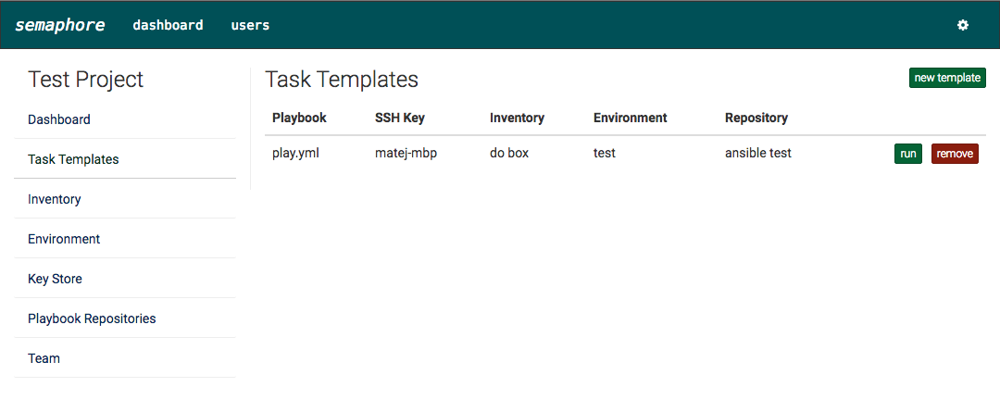

semaphore
=========

Open Source Alternative to Ansible Tower



Features
--------

The basics of Ansible Tower, but in addition:

- Fast, Simple interface that doesn’t get in the way
- Task output is streamed live via websocket
- Free. MIT Licensed. Do what you want.

How to run:
-----------

1. Install Vagrant
2. Run `vagrant up`
3. Open [localhost:3000](http://localhost:3000)

Development steps:

Install requirements:
- node.js >= 0.11.x
- an isolated environment (e.g. Docker / NodeGear)
- ansible (the tool)
- mongodb & redis
- Sudo access (this might change). To run jobs, this tool writes private keys to /root/.ssh and copies playbook directories to /root/.

1. Copy `lib/credentials.default.json` to `lib/credentials.json` and customise, or export relevant environment variables
2. `bower install`
3. `node bin/semaphore`

Initial Login
-------------

```
Email:			'admin@semaphore.local'
Password:		'CastawayLabs'
```

Environment Variables
---------------------

Use these variables to override the config.

| Variable Name | Description            | Default Value                   |
| ------------- | ---------------------- | ------------------------------- |
| PORT          | Web Port               | `80`                            |
| REDIS_PORT    | Redis Port             | `6379`                          |
| REDIS_HOST    | Redis Hostname         | `127.0.0.1`                     |
| REDIS_KEY     | Redis auth key         |                                 |
| BUGSNAG_KEY   | Bugsnag API key        |                                 |
| SMTP_USER     | Mandrill smtp username |                                 |
| SMTP_PASS     | Mandrill smtp password |                                 |
| MONGODB_URL   | Mongodb URL            | `mongodb://127.0.0.1/semaphore` |

Note to Ansible guys
--------------------

> Thanks very much for making Ansible, and Ansible Tower. It is a great tool!. Your UI is pretty horrible though, and so we'd be happy if you could learn and use parts of this tool in your Tower.

It would be amazing if this could be your `Community Edition` of Ansible Tower.
